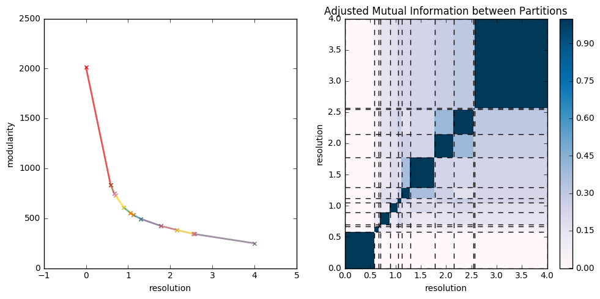

.. CHAMP documentation master file, created by
   sphinx-quickstart on Tue Jul 11 15:50:43 2017.
   You can adapt this file completely to your liking, but it should at least
   contain the root `toctree` directive.

=================================
Louvain Parallel Extension
=================================

CHAMP can be used with partitions generated by any community detection algorithm.  One of the most popular \
and fast algorithms is known as Louvain :cite:`Blondel:2008vn` .  We provide an extension to the python package \
developed by Vincent Traag, `louvain_igraph <https://github.com/vtraag/louvain-igraph>`_  :cite:`traag_louvain` to \
run Louvain in parallel, while calculating the coefficients necessary for CHAMP.  Currently, this extension only \
support single-layer network.  The random seed is set within each parallel process to ensure that the results are
stochastic over each run.  In general this is desireable because Louvain uses a greedy optimization schema that \
finds *local* optima.

.. autofunction:: champ.louvain_ext.parallel_louvain

We also have created a convenient class for managing and merging groups of partitions \
called :mod:`champ.louvain_ext.PartitionEnsemble` .  This class stores the partitions in membership vector form \
( i.e. a list of N community assignments), as well as the coefficients for the partitions.  As part of its \
constructor, the PartitionEnsemble applies CHAMP to all of its partitions, and stores the domains of dominance.

.. _`louvain_ext.PartitionEnsemble`:
.. autoclass:: champ.louvain_ext.PartitionEnsemble
    :members: add_partitions,merge_ensemble,apply_CHAMP,plot_modularity_mapping,save,save_graph,open

----------------------------
Partition Ensemble Example
----------------------------
We use igraph to generate a random ER graph, call louvain in parallel, and apply CHAMP to the ensemble.  This example \
took approximately 1 minute to run on 2 cores.
::

    import champ
    import igraph as ig
    import tempfile
    import numpy as np
    import matplotlib.pyplot as plt

    np.random.seed(0)
    test_graph=ig.Graph.Erdos_Renyi(500,p=.05)
    #Create temporary file for calling louvain
    tfile=tempfile.NamedTemporaryFile('wb')
    test_graph.write_graphmlz(tfile.name)

    #non-parallelized wrapper
    ens1=champ.run_louvain(tfile.name,nruns=5,gamma=1)

    #parallelized wrapper
    test_graph2=ig.Graph.Random_Bipartite(n1=100,n2=100,p=.1)
    ens2=champ.parallel_louvain(test_graph2,
                                      numruns=1000,start=0,fin=4,maxpt=4,
                                      numprocesses=2,
                                      progress=True)

    print ("%d of %d domains after application of CHAMP"%(len(ens2.ind2doms),ens2.numparts))
    #plot both of these
    plt.close()
    f,a=plt.subplots(1,3,figsize=(21,7))
    a1,a2,a3=a
    champ.plot_single_layer_modularity_domains(ens2.ind2doms,ax=a1,labels=True)
    champ.plot_similarity_heatmap_single_layer(ens2.partitions,ens2.ind2doms,ax=a2,title=True)

    #PartitionEnsemble has method to plot downsampled summary of all partitions
    #with optmal transitions and number of communities overlayed.

    ens2.plot_modularity_mapping(ax=a3,no_tex=False)
    plt.tight_layout()
    plt.show()

Output\:

|   Run 0 at gamma = 0.000.  Return time: 0.0311
|   Run 200 at gamma = 0.800.  Return time: 0.0508
|   Run 100 at gamma = 0.400.  Return time: 0.0316
|   Run 300 at gamma = 1.200.  Return time: 0.0736
|   Run 400 at gamma = 1.600.  Return time: 0.0889
|   Run 500 at gamma = 2.000.  Return time: 0.1135
|   Run 600 at gamma = 2.400.  Return time: 0.0691
|   Run 700 at gamma = 2.800.  Return time: 0.0743
|   Run 800 at gamma = 3.200.  Return time: 0.0698
|   Run 900 at gamma = 3.600.  Return time: 0.1002
|   10 of 1000 domains after application of CHAMP

.. _`part_ens_exp`:

============================================
Creating and Managing Large Partition Sets
============================================

For large sets of partitions on larger networks, loading the entire set of partitions each time you want to \
access the data is a waste of time and memory.  As such we have equiped :mod:`champ.louvain_ext.PartitionEnsemble` \
objects with the ability to write to and access hdf5 files.  Instead of loading the entire set of partitions each \
time, only the coefficients and the domains of dominance information is loaded, and individual partitions ( or \
all partitions) can be access from file only if needed.

------------------------------------------------
Saving and Loading PartitionEnsemble with hdf5
------------------------------------------------

::

    import champ
    import igraph as ig
    import numpy as np

    np.random.seed(0)
    test_graph=ig.Graph.Erdos_Renyi(n=200,p=.1)
    times={}
    run_nums=[100]

    ensemble=champ.parallel_louvain(test_graph,numprocesses=2,numruns=200,start=0,fin=4,maxpt=4,progress=False)
    print "Ensemble 1, Optimal subset is %d of %d partitions"%(len(ensemble.ind2doms),ensemble.numparts)
    ensemble.save("ensemble1.hdf5",hdf5=True)

    ensemble2=champ.parallel_louvain(test_graph,numprocesses=2,numruns=200,start=0,fin=4,maxpt=4,progress=False)
    print "Ensemble 2, Optimal subset is %d of %d partitions"%(len(ensemble2.ind2doms),ensemble2.numparts)
    ensemble2.save("ensemble2.hdf5",hdf5=True)

    #Esembles can be merged as follows:

    #Create new PartitionEnsemble from scratch
    ensemble3=ensemble.merge_ensemble(ensemble2,new=True)
    print "Ensemble 3, Optimal subset is %d of %d partitions"%(len(ensemble3.ind2doms),ensemble3.numparts)

    #Use largest of the 2 PartitionEnsembles being merged  and modify
    ensemble4=ensemble.merge_ensemble(ensemble3,new=False)
    print "Ensemble 4, Optimal subset is %d of %d partitions"%(len(ensemble4.ind2doms),ensemble4.numparts)
    print "ensemble4 is ensemble3: ",ensemble4 is ensemble3

Output\:

|   Ensemble 1, Optimal subset is 13 of 200 partitions
|   Ensemble 2, Optimal subset is 15 of 200 partitions
|   Ensemble 3, Optimal subset is 15 of 400 partitions
|   Ensemble 4, Optimal subset is 15 of 600 partitions
|   ensemble4 is ensemble3:  True

References
___________

.. bibliography:: biblio.bib
    :style: plain
    :filter: docname in docnames

* :ref:`genindex`
* :ref:`search`

