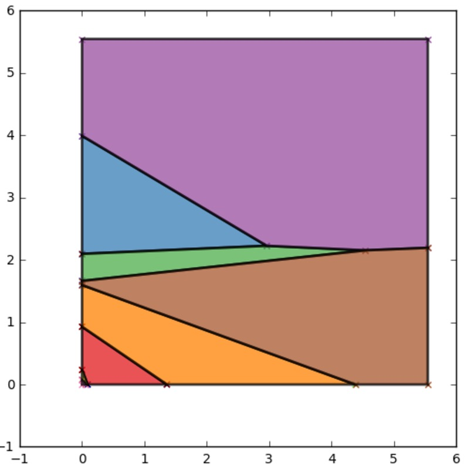

.. CHAMP documentation master file, created by
   sphinx-quickstart on Tue Jul 11 15:50:43 2017.
   You can adapt this file completely to your liking, but it should at least
   contain the root `toctree` directive.

..  _running:

Running CHAMP
**************

CHAMP uses the quick hull algorithm to find the intersection of the space above all of the planes representing \
the input set of partitions as shown in :ref:`Single Layer <SingleLayer_CHAMP>` and :ref:`Multilayer <Multilayer_CHAMP>`. \
There are many tools

=================================
Starting from Partitions
=================================

If the partitions were generated using a modularity based community detection method, it's better to calculate \
the coefficients while optimizing the communities and feed these into CHAMP directly.  This is especially true, \
if the community detection is being performed in parallel.  However, if the partitions were generated using some \
other form of community detection algorithm, we provide a method to compute these coefficients directly and allow \
for parallelization of this process on supported machines.

.. autofunction:: champ.champ_functions.create_coefarray_from_partitions

------------------------------------
Coeffients from Partitions Example
------------------------------------

=======================================
Starting from Partition Coefficients
=======================================

In practice, it is often easier to calculate the coefficients while running performing the community detection \
to generate the input ensemble of partitions, especially if these partitions are being generated in parallel. \
If these have been generated already, one can apply CHAMP directly via the following call.  The same command is \
used in both the Single Layer and Multilayer context, with the output determined automatically by the number \
of coefficients supplied in the input array.

.. autofunction:: champ.champ_functions.get_intersection

------------------------------------------------
Applying CHAMP to Coefficients Array Example
------------------------------------------------
::

    import champ
    import matplotlib.pyplot as plt

    #generate random coefficent matrices
    coeffs=champ.get_random_halfspaces(100,dim=3)
    ind_2_dom=champ.get_intersection(coeffs)

    ax=champ.plot_2d_domains(ind_2_dom)
    plt.show()

Output [1]_ \:

.. _`example1_out`:

* :ref:`genindex`
* :ref:`search`

.. [1] Note that actual output might differ due to random seeding.
